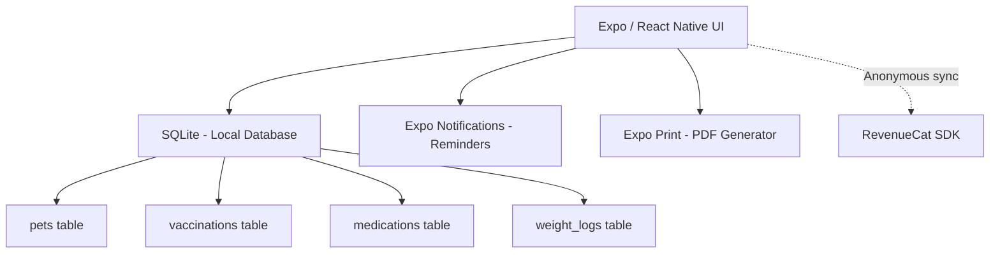

# PetPulse Architecture

**Document:** ARCHITECTURE.md  
**Product:** PetPulse  
**Publisher:** Heldig Lab  

## Architectural Principles & Competitive Edge

- **Strictly No Backend:** No pet profiles or schedules are transmitted to the cloud. Everything lives securely on the device.
- **Native Reminders:** Relies on Expo Notifications (Local OS Alarms) for recurring medication alerts (e.g., "Give Heartgard to Luna today"). This ensures reminders work even in Airplane mode.
- **One Price Forever:** A $14.99 one-time non-consumable purchase.

## System Context



## High-Level Component Model

### Client Layer
- **Zustand:** Global state for the active `pet_id`.
- **SQLite (expo-sqlite):** Stores all structured health data. Handles queries for expiring vaccinations (e.g., `SELECT * FROM vaccinations WHERE expiration_date < +30 days`).
- **Expo Print:** Compiles the SQLite data into a formatted HTML string, then generates a printable PDF passport.

### RevenueCat Integration

**SDK:** `react-native-purchases` (RevenueCat React Native SDK)
**Authentication:** Anonymous App User IDs (no account creation required)

#### Product Configuration

| Platform | Product ID | Type | Price |
|----------|-----------|------|-------|
| iOS | `petpulse_premium` | Non-Consumable | $14.99 |
| Android | `petpulse_premium` | Non-Consumable | $14.99 |

#### Entitlements

| Entitlement | Grants Access To |
|------------|-----------------|
| `premium` | Multiple Pet Profiles (free tier limited to 1), unlimited recurring medication reminders, PDF Passport export engine |

#### Implementation Flow

1. **App Launch:** Initialize RevenueCat SDK with anonymous user ID. Check entitlement status from cache.
2. **Paywall Display:** Show paywall when user hits free-tier limit. Fetch offerings from RevenueCat (falls back to cached offerings if offline).
3. **Purchase:** Call `purchasePackage()`. RevenueCat handles receipt validation with Apple/Google servers.
4. **Verification:** On success, RevenueCat updates entitlement. App checks `customerInfo.entitlements.active['premium']`.
5. **Restore:** "Restore Purchases" button calls `restorePurchases()`. Essential for users reinstalling or switching devices.
6. **Offline Fallback:** RevenueCat caches entitlement status locally. Premium access persists offline after initial verification. Cache TTL: 25 hours (RevenueCat default). If cache expires while offline, maintain last-known premium status until next successful server check.

#### Error Handling

- **Purchase cancelled:** No action. Return to paywall.
- **Purchase failed:** Show "Purchase couldn't be completed. Please try again." Do not retry automatically.
- **Network error during restore:** Show "Couldn't reach the App Store. Check your connection and try again."
- **Receipt validation failed:** Log error. Show generic "Something went wrong" message. Do not grant premium.

### The "No Backend" Reality
- We do not host images of the pets. Any profile photo is saved to the local Expo FileSystem and heavily compressed to prevent app bloat. No server, no hosting fees.

## Data Model (SQLite)

### SQLite Schema

All dates are stored as ISO-8601 TEXT (`YYYY-MM-DD` or `YYYY-MM-DDTHH:MM:SS`). The single database file is `petpulse.db`, created on first launch via `expo-sqlite`.

```sql
-- Core pet profiles
CREATE TABLE pets (
    id            INTEGER PRIMARY KEY AUTOINCREMENT,
    name          TEXT    NOT NULL,               -- display name ("Luna")
    species       TEXT    NOT NULL,               -- e.g. 'dog', 'cat', 'rabbit'
    breed         TEXT,                           -- free-text breed description
    date_of_birth TEXT,                           -- ISO date, nullable if unknown
    weight_unit   TEXT    NOT NULL DEFAULT 'kg',  -- 'kg' or 'lb'
    microchip_id  TEXT,                           -- optional chip number
    photo_path    TEXT,                           -- local Expo FileSystem URI
    is_active     INTEGER NOT NULL DEFAULT 1,     -- soft-delete flag
    created_at    TEXT    NOT NULL DEFAULT (datetime('now'))
);

-- Vaccination records linked to a pet
CREATE TABLE vaccinations (
    id                INTEGER PRIMARY KEY AUTOINCREMENT,
    pet_id            INTEGER NOT NULL REFERENCES pets(id) ON DELETE CASCADE,
    name              TEXT    NOT NULL,            -- vaccine name ("Rabies 3-Year")
    date_administered TEXT    NOT NULL,            -- ISO date the shot was given
    expiry_date       TEXT,                        -- ISO date when booster is due
    vet_name          TEXT,                        -- administering veterinarian
    notes             TEXT,
    created_at        TEXT    NOT NULL DEFAULT (datetime('now'))
);

-- Ongoing or past medication prescriptions
CREATE TABLE medications (
    id         INTEGER PRIMARY KEY AUTOINCREMENT,
    pet_id     INTEGER NOT NULL REFERENCES pets(id) ON DELETE CASCADE,
    name       TEXT    NOT NULL,                   -- drug name ("Heartgard Plus")
    dosage     TEXT,                               -- e.g. "68 mcg"
    frequency  TEXT,                               -- e.g. "monthly", "twice daily"
    start_date TEXT    NOT NULL,
    end_date   TEXT,                               -- NULL = ongoing
    is_active  INTEGER NOT NULL DEFAULT 1,         -- 0 when course is finished
    created_at TEXT    NOT NULL DEFAULT (datetime('now'))
);

-- Individual dose-given events (drives reminder state)
CREATE TABLE medication_logs (
    id            INTEGER PRIMARY KEY AUTOINCREMENT,
    medication_id INTEGER NOT NULL REFERENCES medications(id) ON DELETE CASCADE,
    given_at      TEXT    NOT NULL,                -- ISO timestamp when dose was given
    notes         TEXT
);

-- Weight tracking over time
CREATE TABLE weight_logs (
    id          INTEGER PRIMARY KEY AUTOINCREMENT,
    pet_id      INTEGER NOT NULL REFERENCES pets(id) ON DELETE CASCADE,
    weight      REAL    NOT NULL,                  -- value in pet's weight_unit
    recorded_at TEXT    NOT NULL                   -- ISO timestamp
);

-- App-wide key/value settings (units, notification prefs, etc.)
CREATE TABLE settings (
    key   TEXT PRIMARY KEY,
    value TEXT
);

-- Indexes for foreign-key lookups and reminder scheduling
CREATE INDEX idx_vaccinations_pet_id       ON vaccinations(pet_id);
CREATE INDEX idx_medications_pet_id        ON medications(pet_id);
CREATE INDEX idx_medication_logs_med_id    ON medication_logs(medication_id);
CREATE INDEX idx_medication_logs_given_at  ON medication_logs(given_at);
CREATE INDEX idx_weight_logs_pet_id        ON weight_logs(pet_id);
```